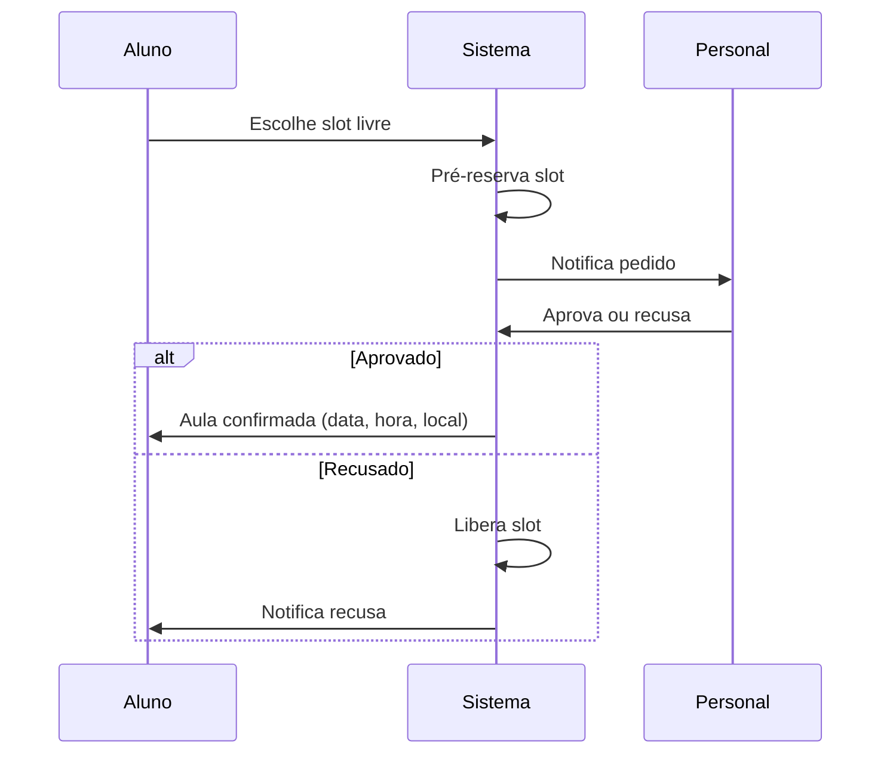

# Pro-Personal — Documento de Escopo

> Versão: 1.1 (planejamento)  
> Idioma: PT-BR  
> Plataforma inicial: Web responsiva (mobile-first)  
> Status: **Sem implementação** — referência para desenvolvimento

---

## 1. Visão do produto

**Pro-Personal** é uma plataforma web para o mercado de personal trainers presenciais e seus alunos. O personal gerencia treinos, agenda (com múltiplos locais), alunos e assinatura; o aluno executa treinos, agenda aulas, comenta exercícios e conversa com o personal. A plataforma inclui descoberta de personais, moderação administrativa e monetização por pacotes.

### 1.1 Princípios

| Princípio | Descrição |
|-----------|-----------|
| Aluno sempre vinculado | Nenhum aluno usa o app sem vínculo ativo com pelo menos um personal |
| Contexto por vínculo | Treinos, agenda, chat e comentários pertencem a um vínculo aluno ↔ personal |
| Presencial primeiro | Agenda com data, hora e **local físico** explícitos |
| Plataforma moderada | Categorias e contas passam por governança do admin |

---

## 2. Personas e papéis

### 2.1 Personal (professor)

- Cadastra perfil, categorias, locais de atendimento e disponibilidade semanal
- Monta treinos; aprova/recusa pedidos de agendamento
- Conversa com alunos (por vínculo) e com admin (suporte)
- Assina plano após trial de 30 dias

### 2.2 Aluno

- Pode ter **múltiplos** personais (cada um em vínculo separado)
- Alterna contexto entre personais no app
- Executa treinos prescritos; comenta por exercício
- Solicita horários em slots livres; solicita vínculo via descoberta ou convite
- **Não permanece** na plataforma sem pelo menos um vínculo **ativo**

### 2.3 Administrador

- Governança da plataforma: usuários, categorias, suporte
- Chat **somente** com personais (não acessa chat aluno ↔ personal)
- Visualiza listas de alunos por personal e agendas (suporte/auditoria)
- Aprova/recusa solicitações de novas categorias
- Bloqueia ou exclui (recomendado: exclusão lógica) personal ou aluno

---

## 3. Regras de negócio consolidadas

### 3.1 Vínculo aluno ↔ personal

- Um registro de vínculo liga um aluno a um personal
- Estados sugeridos: `pendente` | `ativo` | `encerrado` | `bloqueado`
- Origem: convite do personal **ou** solicitação do aluno (descoberta) — personal deve **aceitar** para ativar
- Aluno com zero vínculos ativos: acesso bloqueado (onboarding direciona para convite, descoberta ou aceite pendente)
- Cada vínculo isola: treinos, agenda, chat, histórico de aulas

### 3.2 Categorias (especialidades)

- Lista **curada** de categorias aprovadas (ex.: Musculação, Boxe, Jiu-jitsu, Funcional, …)
- Personal seleciona múltiplas categorias no perfil
- Se não encontrar: **solicitar nova categoria** (nome + descrição opcional)
  - Status: `em_analise` | `aprovada` | `recusada`
  - Enquanto pendente: não entra na lista pública; personal usa apenas categorias já aprovadas
- Admin aprova ou recusa (com motivo opcional na recusa)

### 3.3 Locais de atendimento

- Personal cadastra um ou mais **locais**:
  - Nome (ex.: Academia XYZ – Unidade Centro)
  - Endereço completo
  - Opcional: link para mapa, observações
- Disponibilidade semanal é definida **por local** (dia, intervalo, duração do slot)
- Aula confirmada armazena **snapshot** do local (nome + endereço na data do agendamento)

### 3.4 Agenda e slots

**Disponibilidade**

- Personal define, por local, janelas na semana (ex.: terça 8h–12h, slots de 60 min)

**Cálculo de slots livres**

```
Slots livres = slots da disponibilidade semanal
               − aulas confirmadas
               − pré-reservas (pedidos pendentes)
               − bloqueios manuais (férias, etc.)
```

**Pedido de agendamento (aluno)**

1. Aluno vê slots livres do personal (contexto do vínculo)
2. Escolhe slot → cria pedido com status `pendente`
3. Slot entra em **pré-reserva** (ocupa agenda imediatamente)
4. **Notifica** o personal sobre o pedido
5. Personal **aprova** → aula `confirmada` | **recusa** → libera slot + notifica aluno

**Exibição para o aluno (aula confirmada ou pendente aprovada)**

```
[Dia da semana], [DD/MM/AAAA] · [HH:mm] – [HH:mm]
[Nome do local]
[Endereço completo]
[Abrir no mapa] (link externo)
```

**Cancelamento e remarcação**

| Regra | Detalhe |
|-------|---------|
| Quem pode | Aluno e personal |
| Antecedência mínima | **1 hora** antes do início (ambos), exceto exceção abaixo |
| Efeito do cancelamento | Slot volta a livre; notificar a outra parte |
| Imprevisto do personal | Personal pode **remarcar a qualquer momento** (ignora regra de 1h); pode alterar data, hora e/ou local |
| Remarcação | Registrar histórico; aluno recebe notificação com novos dados |

### 3.5 Treinos

- Personal monta treino; aluno **não** monta ficha livre
- Por exercício: séries, repetições, carga, descanso, observações do personal
- Aluno registra execução e pode adicionar **comentário por exercício**
- Histórico por vínculo (evolução de cargas/reps)

### 3.6 Chat

| Canal | Participantes | Conteúdo |
|-------|---------------|----------|
| Treino | — | Comentários por exercício (contextual) |
| Vínculo | Aluno ↔ Personal | Texto, fotos, arquivos |
| Plataforma | Admin ↔ Personal | Texto, fotos, arquivos |

- Admin **não** visualiza conversas aluno ↔ personal
- Mensagens não lidas (badge) no MVP web; push/e-mail em fase posterior

### 3.7 Descoberta de personal

- Perfil **público** do personal: foto, bio, categorias aprovadas, locais/cidades
- Busca/filtros: categoria, cidade, academia/local (opcional)
- Aluno envia **solicitação de contato/vínculo** — não agenda aula sem vínculo ativo
- Personal aceita ou recusa vínculo (mesmo fluxo de convite invertido)

### 3.8 Trial e monetização (personal)

**Trial**

- **30 dias** a partir do cadastro da conta de personal
- Durante trial: funcionalidades completas

**Após trial sem assinatura ativa**

| Ação | Comportamento |
|------|----------------|
| Aprovar novas marcações | Bloqueado |
| Adicionar novos alunos / aceitar novos vínculos | Bloqueado |
| Demais funcionalidades | **Somente leitura** (tudo travado para escrita) |

**Planos (pacotes por alunos ativos)**

| Faixa | Alunos ativos | Preço/mês |
|-------|---------------|-----------|
| **Starter** | 1 a 10 | R$ 20,00 (fixo) |
| **Pro** | 11 a 30 | R$ 50,00 (fixo) |
| **Pro+** | acima de 30 | R$ 50,00 + **R$ 1,50 × E**, onde **E** = excedente acima de 30 |

**Fórmula**

- **A** = quantidade de alunos ativos (total)
- **E** = excedente = `max(0, A − 30)` (somente alunos **acima** do 30º)

```
A ≤ 10   → R$ 20,00
A ≤ 30   → R$ 50,00
A > 30   → R$ 50,00 + (E × R$ 1,50)   com E = A − 30
```

**Exemplos**

| Alunos ativos (A) | Excedente (E) | Cálculo | Total/mês |
|-------------------|---------------|---------|-----------|
| 8 | — | Starter | R$ 20,00 |
| 25 | — | Pro | R$ 50,00 |
| 35 | 5 | 50 + 5×1,50 | R$ 57,50 |
| 50 | 20 | 50 + 20×1,50 | R$ 80,00 |

- Contagem: **alunos ativos** no vínculo (critério sugerido: vínculo ativo com atividade nos últimos 30 dias ou aula/treino registrado no período — fechar na implementação)
- Cobrança mensal recalculada conforme N (upgrade/downgrade automático entre faixas)
- Aluno **não paga** uso da plataforma
- Pagamento integrado: fase 2 (pós-MVP core); durante trial e validação pode ser manual

---

## 4. Modelo de dados (conceitual)

```
User
  ├── role: personal | aluno | admin
  └── perfil, status (ativo | bloqueado | excluido)

PersonalProfile
  ├── bio, foto
  ├── categorias[] (aprovadas)
  └── visibilidade publica (descoberta)

Category
  ├── nome, slug
  └── status: aprovada (lista publica)

CategoryRequest
  ├── personal_id, nome, descricao
  └── status: em_analise | aprovada | recusada

Location (do personal)
  ├── nome, endereco, mapa_url, notas

AvailabilityRule
  ├── personal_id, location_id
  ├── dia_semana, hora_inicio, hora_fim, duracao_slot

ScheduleBlock (opcional)
  └── bloqueio manual de intervalo

Booking
  ├── vinculo_id, location_id (snapshot)
  ├── inicio, fim
  ├── status: pendente | confirmada | recusada | cancelada
  └── pre_reserva: true enquanto pendente

WorkoutPlan / WorkoutSession / Exercise / ExerciseLog
  └── escopo: vinculo_id

Comment (exercicio)
  └── exercise_log_id, autor, texto

Conversation
  ├── tipo: vinculo | admin_personal
  └── participantes

Message
  └── texto | arquivo | foto

Subscription (personal)
  ├── faixa: starter | pro | pro_plus (variável acima de 30)
  ├── alunos_ativos_contagem, valor_mensal_calculado
  ├── trial_ends_at
  └── status: trial | ativa | expirada | leitura

Vinculo
  ├── aluno_id, personal_id
  ├── status
  └── origem: convite | descoberta
```

---

## 5. Fluxos principais

### 5.1 Onboarding personal

1. Cadastro → inicia trial (30 dias)
2. Perfil: categorias, locais, disponibilidade
3. Convidar aluno ou aguardar solicitações da descoberta

### 5.2 Onboarding aluno

1. Cadastro
2. **Obrigatório:** aceitar convite OU solicitar vínculo (descoberta) OU aguardar aceite
3. Sem vínculo ativo → telas de busca/convite apenas

### 5.3 Agendamento



### 5.4 Solicitação de categoria

1. Personal solicita nova categoria
2. Admin analisa fila
3. Aprovada → entra na lista global; personal pode selecionar
4. Recusada → personal notificado com motivo

### 5.5 Pós-trial

1. Sistema detecta trial expirado sem plano
2. Modo leitura + bloqueio de novos vínculos e aprovações
3. Tela de assinatura (faixa atual + valor calculado; exemplos Starter / Pro / Pro+)

---

## 6. Mapa de telas

### 6.1 Personal

| Tela | Funções |
|------|---------|
| Dashboard | Aulas hoje, pedidos pendentes, resumo alunos |
| Alunos | Lista por vínculo; convite; aceitar solicitações |
| Agenda | Semana; disponibilidade; locais; aprovar/recusar pedidos |
| Treinos | Por aluno: montar, histórico |
| Chat | Por aluno (vínculo) |
| Chat Admin | Mensagens com plataforma |
| Perfil | Categorias, solicitar categoria, locais, bio, perfil público |
| Assinatura | Plano, trial, upgrade |

### 6.2 Aluno

| Tela | Funções |
|------|---------|
| Seletor de personal | Troca de contexto entre vínculos |
| Home | Treino do dia (personal ativo) |
| Treino | Execução + comentários por exercício |
| Agendar | Calendário de slots livres |
| Minhas aulas | Pendentes, confirmadas, histórico (data, hora, local) |
| Chat | Com personal ativo |
| Descoberta | Buscar personal; solicitar vínculo |
| Perfil | Dados da conta |

### 6.3 Admin

| Tela | Funções |
|------|---------|
| Dashboard | Métricas básicas (usuários, pedidos categoria) |
| Personais | Lista, detalhe, alunos do personal, agenda (visualização) |
| Alunos | Lista, bloquear, excluir |
| Categorias | Lista + fila de solicitações |
| Chat | Com personais |
| Moderação | Bloquear / excluir contas |

---

## 7. Fases de entrega sugeridas

### Fase 1 — Núcleo operacional

- [ ] Auth e papéis (personal, aluno)
- [ ] Vínculo (convite + aceite); aluno sem vínculo bloqueado
- [ ] Múltiplos vínculos no aluno + seletor de contexto
- [ ] Locais + disponibilidade semanal + cálculo de slots
- [ ] Pedido com pré-reserva + notificação + aprovação/recusa
- [ ] Exibição clara: data, hora, local (endereço + mapa)
- [ ] Cancelamento/remarcação (regra 1h + exceção personal)
- [ ] Treinos + comentário por exercício
- [ ] Chat aluno ↔ personal (texto + imagem; arquivos se couber)
- [ ] Categorias fixas no perfil

### Fase 2 — Plataforma e receita

- [ ] Painel admin (usuários, agendas visualização, bloqueio)
- [ ] Solicitação e aprovação de categorias
- [ ] Chat admin ↔ personal
- [ ] Trial 30 dias + modo leitura + bloqueios pós-trial
- [ ] Planos Starter / Pro / Pro+ (integração pagamento ou fluxo manual documentado)

### Fase 3 — Crescimento

- [ ] Descoberta: perfil público + busca + solicitação de vínculo
- [ ] Chat com arquivos completos se não entrou na Fase 1
- [ ] Notificações (e-mail / push PWA)
- [ ] Simulador de mensalidade na tela de assinatura (preview ao adicionar alunos)
- [ ] Relatórios e métricas para personal

---

## 8. Requisitos não funcionais

| Área | Diretriz |
|------|----------|
| LGPD | Consentimento, exclusão de conta, política de privacidade; chat e fotos sensíveis |
| Segurança | RBAC estrito; admin sem acesso a chat aluno-personal |
| Responsivo | Uso prioritário no celular (aluno no treino/aula) |
| Performance | Cálculo de slots sob demanda ou cache diário por personal |
| Uploads | Limite de tamanho e tipos MIME; armazenamento objeto (S3/R2) |
| i18n | PT-BR apenas no início; estrutura preparada para expansão |

---

## 9. Stack sugerida (referência — não implementada)

| Camada | Sugestão |
|--------|----------|
| Frontend | Next.js (App Router), mobile-first, PWA futuro |
| Backend | API no Next.js ou serviço separado; Prisma ORM |
| Banco | PostgreSQL |
| Auth | E-mail/senha + sessão; papéis no JWT/sessão |
| Arquivos | S3 / Cloudflare R2 |
| Tempo real (chat) | WebSocket ou polling no MVP |
| Hospedagem | Vercel + Neon/Supabase (a confirmar) |

---

## 10. Decisões registradas (checklist)

| # | Decisão | Resposta |
|---|---------|----------|
| 1 | Pedido pendente ocupa slot? | Sim (pré-reserva) + notifica personal |
| 2 | Pós-trial sem plano | Somente leitura (tudo travado para escrita) |
| 3 | Admin vê chat aluno-personal? | Não; só admin ↔ personal |
| 4 | Descoberta | Solicita vínculo; aluno não fica sem personal |
| 5 | Monetização | 1–10 = R$ 20; 11–30 = R$ 50; acima de 30 = R$ 50 + R$ 1,50/aluno excedente |
| 6 | Múltiplos personais por aluno | Sim, contextos isolados |
| 7 | Slots livres | Disponibilidade semanal − ocupados − pré-reservas |
| 8 | Local da aula | Cadastro de locais + snapshot no agendamento |
| 9 | Idioma / nome | PT-BR / **Pro-Personal** |

---

## 11. Pendências para implementação (baixo nível)

- [ ] Critério exato de “aluno ativo” para cobrança do plano
- [ ] Aluno precisa confirmar remarcação do personal ou só notificação?
- [ ] Expiração de pré-reserva se personal não responder em X horas?
- [ ] Política de retenção de dados após exclusão (soft delete)
- [ ] Termos de uso e política de privacidade (textos legais)

---

## 12. Histórico do documento

| Versão | Data | Notas |
|--------|------|-------|
| 1.0 | 2026-05-22 | Consolidação inicial das conversas de planejamento |
| 1.1 | 2026-05-22 | Ajuste de planos: faixa 11–30 e Pro+ (R$ 50 + R$ 1,50 × excedente E) |

---

*Este documento é a fonte de verdade do escopo até nova revisão. Implementação de código deve seguir as fases da seção 7.*
